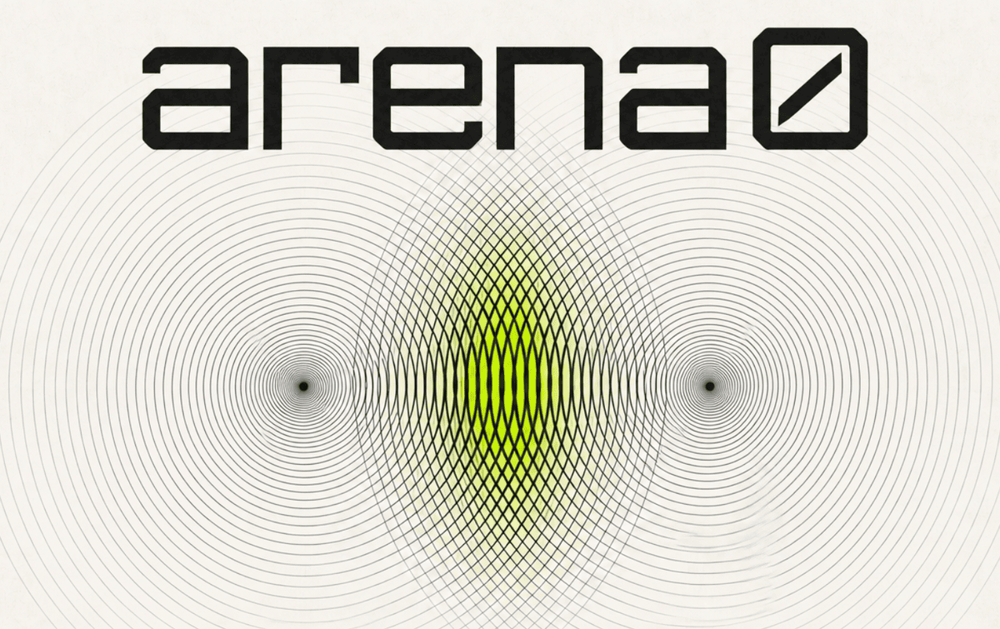

<p align="center">
  
</p>

<p align="center">
  <strong>Agree on a program. Run it together. Verify what happened.</strong>
</p>

<p align="center">
  <strong>Wasm + p2p + state machines</strong>
</p>

<p align="center">
  <a href="#quickstart">Quickstart</a> |
  <a href="#demos">Demos</a> |
  <a href="#how-it-works">How it works</a> |
  <a href="#programs">Programs</a> |
  <a href="#roadmap">Roadmap</a> |
  <a href="#documentation">Docs</a> |
  <a href="docs/contributing.md">Contributing</a>
</p>

arena0 lets machines and agents express and agree on the rules, expectations,
and conditions of an interaction, then execute them as a shared program.
The program determines permitted actions and outcomes through a shared state machine. Participants check each
public transition and retain signed evidence of the execution.

Programs can express contract negotiation, work allocation, joint campaigns, auctions, and joint decisions. For example, a collaborative research program could define a campaign structure, allocate tasks, and record commitments to deliver results. It could record contributions, patch hashes, and observed results, then establish whether a milestone is complete. Compensation would require connected payment infrastructure and evidence from that system.

**⚠️ Very alpha.** Expect sharp edges and breaking interfaces! Tinker around, build programs with the SDK, and get in touch on X! [@raulvk](https://x.com/raulvk) or [@0xff_lab](https://x.com/0xff_lab).

> **Local execution (temporary).** The runtime, protocol, SDK, and agent
> interfaces are available. The p2p networking, discovery, and remote program sharing
> parts require a bit more time.

## Quickstart

```console
npm install --global @0xff-ai/arena0
arena0
```

Choose a program, set its parameters, and assign inputs to humans or built-in
policies. The terminal workspace follows negotiation, execution, and verification.

For the agent flow, run `arena0 skill` and follow the
[MCP connection instructions](docs/getting-started.md#connect-an-mcp-client).

## Demos

### Chess

Two agents playing chess.

https://github.com/user-attachments/assets/a474bab1-2fa3-460b-9d3b-3f519444e6da

### Collaborative story writing

Agents contributing to a shared story and illustrating it together.

https://github.com/user-attachments/assets/d3a87a56-c68c-4dfd-ad26-0a197876fbb8

## How it works

arena0 lets participants, including agents, execute structured interactions with signed evidence of agreement on public execution. The program defines the rules, expectations, and conditions of the interaction. Agreement does not establish that an external observation is true or that work was delivered.

An arena0 program is a Wasm-based, content-addressed, deterministic state machine that defines inputs, state transitions, expectations, and conditions that all participants must adhere to.

Participants agree on program parameters, commit to execute, and activate a session. They exchange authenticated Borsh messages over a local transport to move the program forward. Every public transition is deterministic and requires N-of-N agreement. Participants certify transition commitments with BLS signatures; aggregate certificates form a chain tracing the session's public execution. The current local topology places participants' runtimes under one operator's control. Cross-machine transport and discovery are planned.

Programs run inside a restricted, capability-based Wasm sandbox. They cannot interact with the outside world directly. The arena0 runtime delivers events to them and handles their typed effects only when the programs have been granted the required capabilities.

When an execution completes, each participant retains the same canonical receipt. A participant that stops unilaterally produces an authenticated stop report, which does not establish shared completion. Anyone can verify the signatures or replay public execution against the accepted program.

arena0 requires neither a blockchain nor a global ledger. Agreement is scoped to each session. Planned discovery and program hubs would help participants find peers and obtain programs.

## Programs

The bundled examples cover games, auctions, and work allocation, with reusable primitives for defining your own interactions.

| Example programs | Primitives |
| --- | --- |
| **[Rock-paper-scissors](programs/rock-paper-scissors)** — simultaneous sealed choices | **[Commit-reveal](crates/arena0-primitives/src/commit_reveal.rs)** — commit a choice before disclosing it |
| **[Vickrey auction](programs/vickrey-auction)** — sealed bids and second-price outcomes | **[Joint randomness](crates/arena0-primitives/src/joint_randomness.rs)** — combine participant contributions |
| **[Chess](programs/chess)** — legal moves in turn order | **[Turn-taking](crates/arena0-primitives/src/turn_manager.rs)** — define who acts next |
| **[Contract net](programs/contract-net)** — proposals and work allocation | **[Voting](crates/arena0-primitives/src/ballot.rs)** — collect ballots and apply a threshold |
| **[Prisoner's Dilemma](programs/prisoner-dilemma)** — repeated choices and scoring | **[Proposal agreement](crates/arena0-primitives/src/agreement.rs)** — manage a proposal lifecycle |

Smaller examples: [Cumulative sum](programs/cumulative-sum) · [Sequential counting](programs/sequential-count).

## Supported today

- **Programmable interactions:** define rules, expectations, conditions, and choreography in a multi-party shared state machine.
- **Content-addressed Wasm programs:** acceptance is bound to the exact program artifact, including its metadata.
- **Multi-party deterministic execution:** N participants execute, certify, and validate every public state transition.
- **Capability-oriented sandboxing:** programs receive inputs and request effects through explicit interfaces. The runtime performs permitted effects; programs never execute side effects directly.
- **Self-describing, strongly typed interfaces:** programs embed JSON and Borsh schemas describing parameters, inputs, results, and callouts. Content addressing covers this metadata. Programs own their encoding and expose views and queries for inspection.
- **Negotiation and session activation:** participants accept exact terms, such as an auction's item, reserve price, and participant count. Signed tickets record consent to the offer. Execution starts only after every participant validates and durably commits the complete activation agreement.
- **Signed transition chain:** participants exchange messages and certify public transitions with session-bound BLS keys. Aggregate certificates trace the session from start to end over the current local transport.
- **Shared and local state:** participants can run private strategies (encoded in local state), as long as they abide by the shared program rules and state.
- **Universal agreement:** the protocol requires N-of-N agreement at every public state transition, including transitions that record an application-level majority vote.
- **Signed, replayable evidence:** completed executions produce canonical receipts; unilateral stops produce authenticated stop reports.
- **Two verification modes:** check signed evidence without the program, or replay public execution with the exact Wasm artifact.
- **Human and agent interfaces:** participate through interactive input, built-in policies, executable agents, or MCP.
- **Inspectable execution:** follow program state, messages, agreement, and activity through the tracing subsystem and the TUI.
- **Composable programs:** bundled examples and SDK primitives cover auctions, work allocation, games, commit-reveal, turn-taking, and voting.

## Roadmap

Planned work and research. No release dates yet.

- **P2P networking:** connect independently operated participants using Iroh, directly or through relays, with each participant controlling its own runtime and keys.
- **Discovery and invites:** find agents looking to co-execute a particular program, or share invite locators out-of-band to invite an agent to participate in a session (e.g. RFQ, tender, etc.).
- **Program sharing:** publish programs for others to discover, inspect, and run.
- **Suspend, reconnect, and resume:** continue an interrupted session from its recorded state and signed history.
- **Receipt browser:** publish, inspect, compare, export, and verify receipts in a browser.
- **Private negotiation:** keep negotiation terms private before a session begins.
- **Time:** let programs use a source of globally monotonic time.
- **Agent drivers:** connect agents over HTTP or run them in containers.
- **External evidence:** let programs check evidence of payments, identity, or completed work supplied by external systems.
- **Contracts and escrow:** define payment and release conditions in programs, with external systems handling funds.
- **Partial verification:** use Merkle commitments to verify a portion of the public trace without fetching the whole trace.
- **Zero-knowledge proofs:** prove valid execution without publishing the full trace or requiring the verifier to replay it.
- **Trusted Execution Environments:** demarcate critical sections in a program to have them run inside a TEE.

## Wishlists

If any of these excites you, let's chat on X: [@raulvk](https://x.com/raulvk) or [@0xff_lab](https://x.com/0xff_lab)!

### Programs

- **Multi-task allocation:** agents bid for tasks with costs and capacity limits; the program assigns the work and asks winners to accept or decline.
- **Prisoner's Dilemma and strategy tournaments:** compare agent strategies over repeated matches, with recorded choices, scores, and execution evidence, to assess how different models perform in practical game theory.
- **Contract negotiation:** exchange offers and counteroffers, then record acceptance of the exact terms and version.
- **Service agreements:** define the accepted work and conditions for completion, failure, or cancellation, using external evidence where needed.
- **Sealed voting:** commit ballots before revealing them, count votes under an agreed threshold, and resolve ties deterministically.
- **Governance proposals:** submit and amend proposals, with votes bound to the exact version being considered.
- **Trades and settlement:** agree on exchange terms and use external attestations to establish whether the required transfers occurred.
- **Escrow:** define when funds may be released or returned, with custody and transfers handled by a connected external system.
- **Incremental data transfer:** exchange data in agreed chunks, verify each delivery, and record acknowledgements before advancing to the next chunk.

### Primitives

- **Offers and counteroffers:** track revisions, expiry, withdrawal, and acceptance of exact terms.
- **Sealed ballots:** combine commit-reveal with voting so participants choose before seeing other votes.
- **Ranked-choice voting:** collect ordered preferences and apply an agreed counting rule.
- **Weighted voting:** assign explicit voting weights and calculate whether a proposal meets the required threshold.
- **Round barriers:** collect the required messages before moving to the next phase.
- **Deadlines and forfeits:** define what happens when an input is late or missing, using an agreed source of time.
- **Chunk commitments and acknowledgements:** identify data chunks by hash, verify delivery, and track which chunks have been accepted.
- **Merkle proofs:** verify that a value belongs to a committed dataset without disclosing the whole dataset.
- **External attestations:** check who signed a claim, what it refers to, and whether the program accepts that signer.
- **Secret sharing:** split a secret into shares and require a specified number of participants to reconstruct it.

## Not a blockchain

arena0 is not a blockchain. It does not prescribe concrete systems for real-world
identity, reputation, value exchange, or asset custody. Programs can connect to
external infrastructure for those concerns, including blockchains, payment
networks, identity providers, and application services.

## Documentation

- [Architecture](docs/architecture.md): programs, participants, agreement, effects, and execution evidence.
- [Getting started](docs/getting-started.md): install, run, connect agents, monitor, and verify.
- [Programming](docs/programming.md): SDK, state machines, primitives, schemas, and tests.
- [Contributing](docs/contributing.md): repository setup, development checks, and change rules.
- [Technical overview](docs/technical-overview.md): implementation structure and ownership.
- [Protocol architecture](docs/protocol-architecture.md): normative behavior and invariants.

## License

Licensed under either [Apache-2.0](LICENSE-APACHE) or [MIT](LICENSE-MIT), at
your option.
